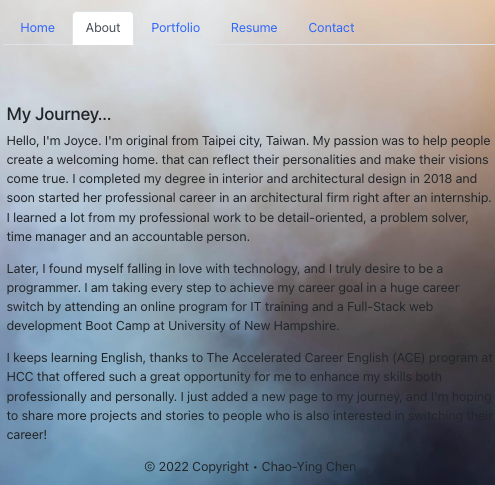
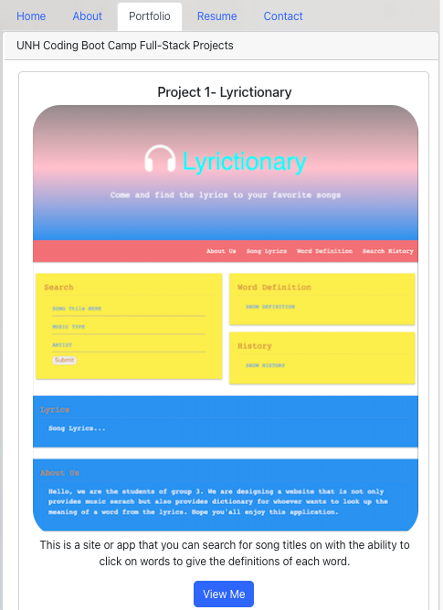
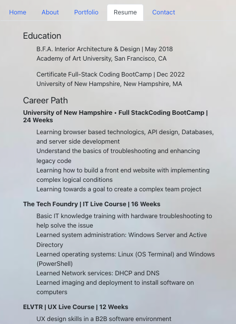
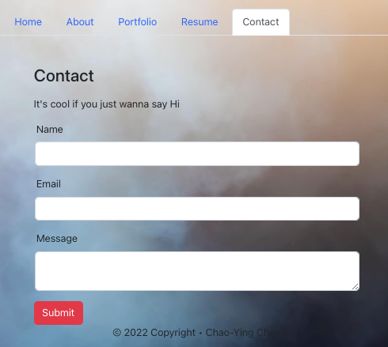

# React-Portfolio

## License and Badges:

 

<!--  -->

 

 

---

## Table of Contents:

- [License and Badges](#license-and-badges)
- [Purpose](#purpose)
- [Installation](#installation)
- [Deployment](#deployment)
- [Demo Website](#demo-website)
- [Screenshots](#screenshots)
- [Deployed URL](#deployed-url)
- [Questions](#questions)

---

## Purpose:

To create this REACT portfolio website called `React-Portfolio` to implement my knowledge in `React.js`.

Using `react-bootstrap` as a library reference to find a preferred layout and components for my website.

Importantly, using `GitHub gh-pages` to deploy React website on GitHub.

---

## Installation:

To create this React Portfolio Website. Please refer the following steps.

1. You need to create a repository on GitHub first and clone SSH key into your local storage in VS Code.

2. You need to run `npx create-react-app my-app` in the terminal to create a React project.

- Note.1: You can rename `my-app` to your desired website name.

- Note.2: create-react-app uses `Babel` and `webpack` to optimize JavaScript applications to increase the overall efficiency.

3. You need to run `cd my-app` in the terminal.

4. You need to run `npm start` in the terminal, this step will open a React Website for you that you just created. It will look like an empty page when you don't have anything yet.

5. Run `npm install react-bootstrap bootstrap` to install react-bootstrap library in your package. So, you can use `React BootStrap` as a library.

---

## Deployment:

**These steps are very important!**

1. You need to add `"homepage": "https://myusername.github.io/my-app",` inside of `package.json` file.

- Note.1: Remember to edit `myusername` to your GitHub username.
- Note.2: Remember to edit `my-app` to your React APP name.

2. You need to run `npm install --save gh-pages` in the terminal to install `gh-pages` and it will add following scripts in your `package.json`. It will look like below:

- `"scripts": {
"predeploy": "npm run build",
"deploy": "gh-pages -d build",
"start": "react-scripts start",
"build": "react-scripts build",`

3. You need to run `npm run deploy` to deploy your website.

4. Go to your GitHub Pages setting. Find the `Branch` under the `Build and deployment`. Select `gh-pages branch` for the deployed branch and keep `/(root)` for the deployed folder.

5. You are all set! The GitHub Page of your React website is creating for you, it might take a few minutes.

---

## Demo Website:

 

**Click to watch**

---

## Screenshots:

 

**About Page**

 

**Portfolio Page**  
 

 

**Resume Page**

 

**Contact Page**  
 

---

## Deployed URL:

- [Github Repository](https://github.com/Joyce750526/React-Portfolio)
- [Deployed Github Page](https://joyce750526.github.io/React-Portfolio/)

---

## Questions:

If you have any questions about this projects, please contact me!

- [Email Me](mailto:joyceideas@outlook.com)
- [Github](https://github.com/joyce750526)

---

Chao-Ying (Joyce) Chen

